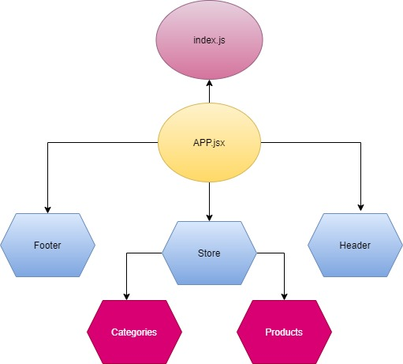

# storefront

The application will power an online storefront that will allow our users to browse our product offerings by category, place items in their shopping cart, and check-out when they are ready to make their purchase

* [Repo Link](https://github.com/engnour94/storefront)

## Development Process, Milestones
### Phase 1: Application Setup
* Basic React Application
* Redux State Management
* State managed in memory
* Material UI Components & Styling
* [Deployed link]()
* **UML**

### Phase 2: Shopping Cart
* Add items to a shopping cart
* Update quantities
* Remove items from the cart
* Show the cart in real-time on the UI

### Phase 3: Live Data
* Connect the application a live API
* Persist changes to products based on cart activity.

###  Phase 4: Checkout & Detail Pages
* Refactor the store to use the latest Redux design pattern (Redux Toolkit)
* Add a cart checkout page
* Add a product details page